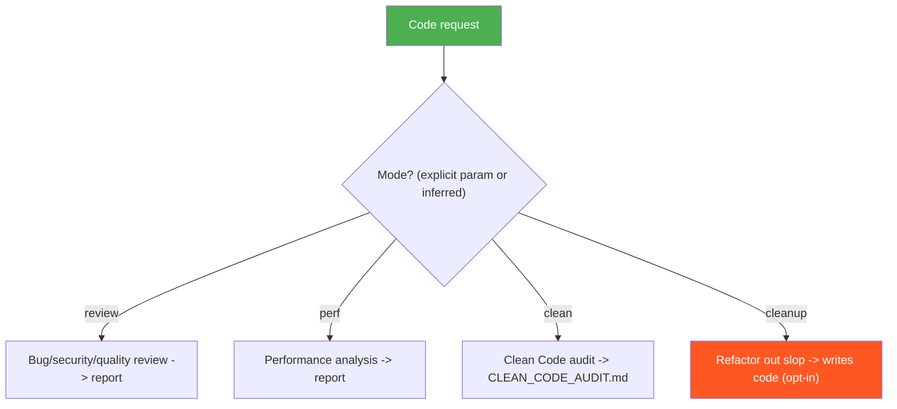

<!--
  DO NOT READ THIS FILE — This README.md is for human catalog browsing only.
  It ships inside the .skill package but is NEVER auto-loaded into agent context.
  The runtime loader only reads SKILL.md + references/ + scripts/ + agents/ when the skill triggers.
  If you're an AI agent, read the SKILL.md file instead for skill instructions.
-->

# Code Review

> One skill for reviewing and improving code — four modes behind a single entry point. It infers
> the mode from your request, or you pass an explicit `mode:`. Three modes are read-only; one
> (`cleanup`) writes code and only runs when you ask for it.

## Modes

| Mode | Use when you want to... | Reads / writes | Output |
|---|---|---|---|
| **review** (default) | find bugs, security holes, quality issues in a diff/PR | read-only | prioritized findings report |
| **perf** | make code faster — bottlenecks, leaks, algorithmic waste | read-only | performance findings report |
| **clean** | audit readability/standards vs the bbv Clean Code cheat sheet | read-only | `CLEAN_CODE_AUDIT.md` |
| **cleanup** | actually refactor out AI slop, dead code, duplication, cruft | **writes code** | modified source files |

## When to Use

| Say this... | Mode |
|---|---|
| "Review this PR", "find bugs", "any security issues?" | review |
| "This is slow", "optimize this", "find the bottleneck" | perf |
| "Clean-code audit", "check readability against standards" | clean |
| "Clean up the codebase", "remove the AI slop and dead code" | cleanup |
| "code-review mode:perf" (explicit override) | perf |

## How It Works



The `cleanup` mode is the only one that modifies files; it never fires by weak inference and confirms before writing.

## Installation

```bash
npx skills add https://github.com/luongnv89/skills --skill code-review
```

Or via [agent-skill-manager (asm)](https://www.npmjs.com/package/agent-skill-manager):

```bash
asm install github:luongnv89/skills:skills/code-review
```

## Usage

```
/code-review              # infers the mode from your request
/code-review mode:perf    # force a specific mode
```

## Resources

| Path | Mode | Description |
|---|---|---|
| `references/review-mode.md` | review | Bug/security/quality review workflow (+ `agents/reviewer.md`, `file-reviewer.md`, `report-assembler.md`; `references/code-smells.md`, `subagent-architecture.md`) |
| `references/perf-mode.md` | perf | Performance analysis workflow (+ `references/language-checks.md`) |
| `references/clean-mode.md` | clean | Clean Code audit workflow (+ `clean-code-checklist.md`, `tdd-checklist.md`, `html-report-guide.md`, `report-template.html`) |
| `references/cleanup-mode.md` | cleanup | Slop-cleanup refactor workflow (+ the 8 cleaner agents in `agents/`) |

## Output

Depends on the mode: a findings report (`review`, `perf`), a `CLEAN_CODE_AUDIT.md` (`clean`), or
modified source files (`cleanup`).
